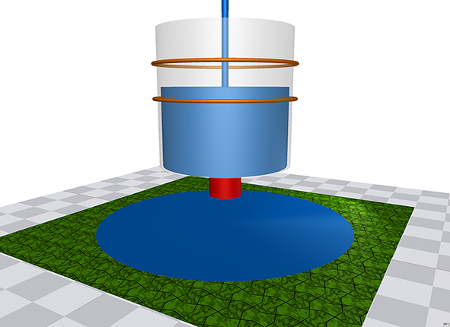

#  Single-tank Water Tank

## Overview

The single-tank water tank pilot study is a simple example that comprises a single water tank which is controlled by a cyber controller. When the water level of the tank reaches a particular level (defined in the controller) the controller sends a command to the tank to empty using an exit valve.

## Supported Features
This study supports the following INTO-CPS technologies:

* 20-Sim (for FMU)
* OpenModelica (for FMU)
* VDM-RT (for FMU)
* INTO-CPS SysML  
* Co-simulation Engine (COE)
* Design Space Exploration
* Code Generation

## Additional Information
Additional Information about this case study can be found in the [Examples Compendium](http://projects.au.dk/fileadmin/D3.5_Examples_Compendium_2.pdf#page=9)

Alternatively, contact the case study owner, [Carl Gamble](mailto:carl.gamble@ncl.ac.uk).
